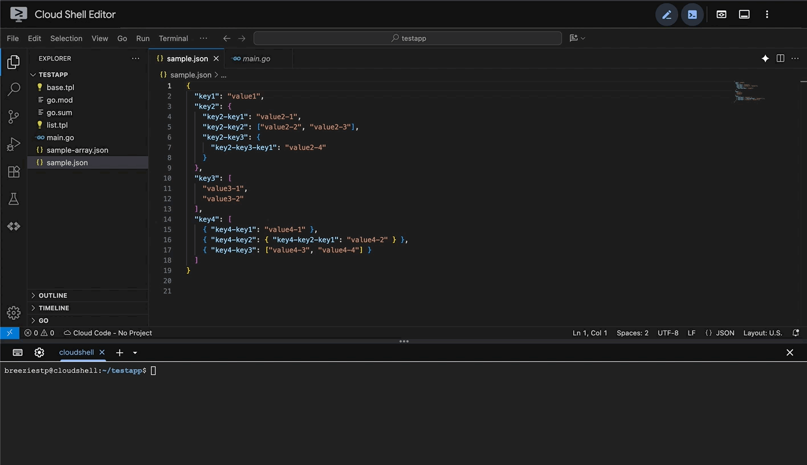

# 🧩 json2table

[](https://opensource.org/licenses/MIT)
[](https://pkg.go.dev/github.com/bgrooot/json2table)
[](https://goreportcard.com/report/github.com/bgrooot/json2table)

JSON 문자열을 HTML 테이블 형태로 변환해주는 Go 라이브러리입니다.

---

## 🚀 사용법
```go
table, err := json2table.Json2table(jsonStr, config.Config{})
```


---

## ⚙️ 설정
> 굵게 표시된 값은 기본 값입니다.

| 설정             | 타입       | 값                           | 설명                                   | 
|----------------|----------|-----------------------------|--------------------------------------|
| `Orientation`  | string   | **vertical**<br/>horizontal | 테이블 레이아웃 방향을 결정합니다                   |
| `CSS`          | string   |                             | 인라인 `<style>` 태그로 삽입할 코드             |
| `CssWebLink`   | string   |                             | 외부 CSS 링크. (`<link ref>` 로 삽입        |
| `TableClass`   | string   |                             | `<table>` 엘리먼트에 적용할 클래스명             |
| `TdClass`      | string   |                             | `<td>` 엘리먼트에 추가할 클래스명                |
| `TrClass`      | string   |                             | `<tr>` 엘리먼트에 추가할 클래스명                |
| `Template`     | []string |                             | 템플릿 문자열 목록                           |
| `TemplateFile` | []string |                             | 템플릿 파일 경로 목록                         |
| `TemplateData` | any      |                             | 템플릿에 전달할 데이터                         |
| `DivideArray`  | bool     | true<br/>**false**          | JSON 배열일 형태인 경우 아이템을 개별 테이블로 분리할지 여부 |
| `WrapWithHTML` | bool     | **true**<br/>false          | 전체 HTML 문서 형태로 출력할 것일지 여부            |

> ⚠️ bool 타입 설정 시 기본 값(`nil`) 을 명시적으로 구분하기 위해 `config.CreateNilBool` 함수를 통해 값을 지정합니다. 

---

## 🧱 예제
### Vertical Layout
```go
cfg := config.Config{Orientation: "vertical"}
table, err := json2table.Json2table(string(jsonStr), cfg)
```
🔗 [결과 보기](https://codepen.io/bgrooot/full/yyeKNWo)

### Horizontal Layout
```go
cfg := config.Config{Orientation: "horizontal"}
table, err := json2table.Json2table(string(jsonStr), cfg)
```
🔗 [결과 보기](https://codepen.io/bgrooot/full/ogbqXrV)

### Custom CSS Link
```go
cfg := config.Config{
  CSSWebLink: "https://cdn.jsdelivr.net/npm/bulma@1.0.4/css/bulma.min.css",
  TableClass: "table is-bordered is-striped is-hoverable is-fullwidth",
}
table, err := json2table.Json2table(string(jsonStr), cfg)
```
🔗 [결과 보기](https://codepen.io/bgrooot/full/bNEvdXw)

### Custom Inline CSS
```go
cfg := config.Config{CSS: "th { background-color: #ebffea; }"}
table, err := json2table.Json2table(string(jsonStr), cfg)
```
🔗 [결과 보기](https://codepen.io/bgrooot/full/JoGLdge)

### JSON Array
```go
cfg := config.Config{}
table, err := json2table.Json2table(string(jsonArrayStr), cfg)
```
🔗 [결과 보기](https://codepen.io/bgrooot/full/ByjroBK)

### JSON Array (Divided)
```go
cfg := config.Config{DivideArray: config.CreateNilBool(true)}
table, err := json2table.Json2table(string(jsonArrayStr), cfg)
```
🔗 [결과 보기](https://codepen.io/bgrooot/full/EaPEVYp)

### Custom Inline Template
```go
base, _ := os.ReadFile("base.tpl")
list, _ := os.ReadFile("list.tpl")
cfg := config.Config{
  CSS:          "h1 { color: red; } li { list-style-type: square; color: blue; }",
  TemplateData: []string{"item1", "item2", "item3"},
  Template:     []string{string(list), string(base)},
}}
table, err := json2table.Json2table(string(jsonStr), cfg)
```
🔗 [결과 보기](https://codepen.io/bgrooot/full/gbPeaOp)

### Custom Template File
```go
cfg := config.Config{
  CSS:          "h1 { color: red; } li { list-style-type: square; color: blue; }",
  TemplateData: []string{"item1", "item2", "item3"},
  TemplateFiles: []string{"cmd/tpl/list.tpl", "cmd/tpl/base.tpl"},
}}
table, err := json2table.Json2table(string(jsonStr), cfg)
```
🔗 [결과 보기](https://codepen.io/bgrooot/full/dPGmYyE)

---

### 🧾 내장 템플릿
  - 아래와 같은 템플릿이 사전 정의 되어 있어 커스텀 탬플릿을 작성할 때 사용할 수 있습니다.

| 템플릿 이름       | 설명                                    |
|--------------|---------------------------------------|
| `base`       | 모든 템플릿들의 진입점 역할을 하는 기본 템플릿            |
| `table`      | JSON 을 `<table>` 형태로 템플릿              |
| `css`        | 설정된 CSS 를 `<style>` 태그로 렌더링           |
| `cssWebLink` | CSSWebLink 주소를 `<link href>` 의 주소로 삽입 | 

#### 예제
```go
{{- define "base" }}
  {{- template "css" . }}
  {{- nindent 0 "<h1>CUSTOM TEMPLATE</h1>" }}
  {{- template "list" . }}
{{- end }}

{{- define "list" }}
  {{- nindent 0 "<ul>" }}
  {{- range .Cfg.TemplateData }}
    {{- printf "<li>%s</li>" . | nindent 4 }}
  {{- end }}
  {{- nindent 0 "</ul>" }}
{{- end }}
```

